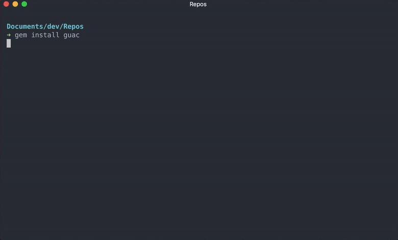

# Guac 🥑

[](https://travis-ci.org/mattboldt/guac)
[](https://codeclimate.com/github/mattboldt/guac)
[](https://badge.fury.io/rb/guac)
[](https://github.com/mattboldt/guac/blob/master/LICENSE.txt)

Guac is a command line program to update multiple local git repos with one command. Guac stands for `git update-all cli`, but it's also just a very easy to type command. Furthermore, it's shorthand for Guacamole, e.g.: "Holy Guacamole, this gem makes updating all my repos very fast and easy".



Guac is written in Ruby, so you'll need to have that installed on your machine, but the functionality itself is language agnostic.

## Installation

    $ gem install guac

## Usage

```bash
# Run setup
guac setup

# Show all statuses
guac status
guac st

# Update all on default branch (master)
guac up
# Update all on release_2019
guac up release_2019
```

## Development

After checking out the repo, run `bin/setup` to install dependencies. Then, run `rake spec` to run the tests. You can also run `bin/console` for an interactive prompt that will allow you to experiment.

To install this gem onto your local machine, run `bundle exec rake install`. To release a new version, update the version number in `version.rb`, and then run `bundle exec rake release`, which will create a git tag for the version, push git commits and tags, and push the `.gem` file to [rubygems.org](https://rubygems.org).

## Contributing

Bug reports and pull requests are welcome on GitHub at https://github.com/mattboldt/guac. This project is intended to be a safe, welcoming space for collaboration, and contributors are expected to adhere to the [Contributor Covenant](http://contributor-covenant.org) code of conduct.

## Copyright

Copyright (c) 2019 Matt Boldt. See [MIT License](LICENSE.txt) for further details.
